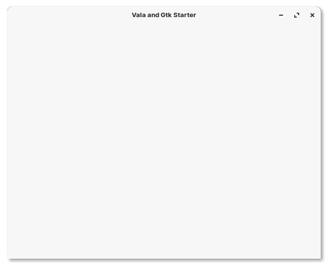
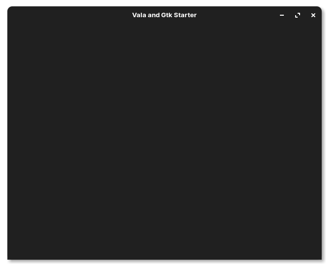

# Vala and Gtk starter

> This application is build on [Zorin OS 16](zorin) (a custom distribution based on Ubuntu 20.04 LTS)

## Table of Contents
 - [Description](#description)
 - [Screenshots](#screenshots)
 - [Dependencies](#dependdencies)
 - [Building](#building)
 - [Building Development Versions](#building-development-versions)
 - [Supported Versions](#supported-versions)
 - [Contributing](#contributing)
 - [Bugs and Issues](#bugs-and-issues)
 - [License](#license)

## Description
**Vala and Gtk starter** is a native Linux desktop GUI application built with Vala and Gtk that is bare bones and helps you easily get started with building your next native Linux desktop app.

## Screenshots



### Dark Mode
(not yet supported in this version but will work with your global Gtk theme)


## Dependencies
You can install this starter by compiling from source, here's the list of dependencies required:

  - [vala >= 0.48.x](https://valadoc.org/)
  - [gtk+-3.0 >= 3.22.29](https://gnome.pages.gitlab.gnome.org/gtk/gtk3/)
  - [granite >= 5.3.0](https://gitlab.gnome.org/GNOME/granite/tree/master/granite5)
  - [meson](https://mesonbuild.com/)

## Building

```bash
meson build --prefix=/usr
sudo ninja -C build install
```

## Building Development Versions

The development version allows you to keep the stable version perfectly working while hacking on **Vala and Gtk Starter**.

```
# Coming Soon
```

## Contributing

Contributions are more than welcome! If you improve on this project, please feel free to share it by submitting a Pull Request.

Before contributing, be sure to check out the [CONTRIBUTING][contrib] and [Branching Model][branching] docs.

## Bugs and Issues

Found a bug? Having an issue with this app? [Open a new issue][issues] here.

## Supported Versions

Below is a list of the currently supported versions of this software.

| Release | Status            | Initial Release | Active LTS Start | Maintenance LTS Start | End of Life |
| :-----: | :---------------: | :-------------: | :--------------: | :-------------------: | :---------: |
| develop | Unstable          | - | - | - | - |
| v1  | :heavy_check_mark: | TBD | TBD | - | TBD |
| v2  | :construction: | TBD| TBD | TBD | TBD |

You can view the Status Key Map and software support model [here][support].

## License

 This project and all of its source code is released and permissively licensed under the [BSD 2 Clause][license] license.

[archive]: https://github.com/davidsaulrodriguez/vala-and-gtk-starter/archive/main.zip
[support]: ./SLC.md
[contrib]: ./CONTRIBUTING.md
[branching]: ./docs/Branching_Model.md
[issues]: https://github.com/davidsaulrodriguez/vala-and-gtk-starter/issues/new/choose
[license]: ./LICENSE
[zorin]: https://zorin.com/